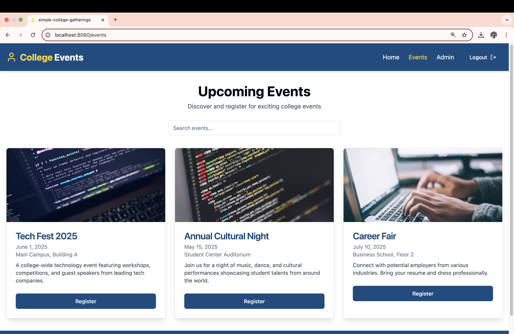
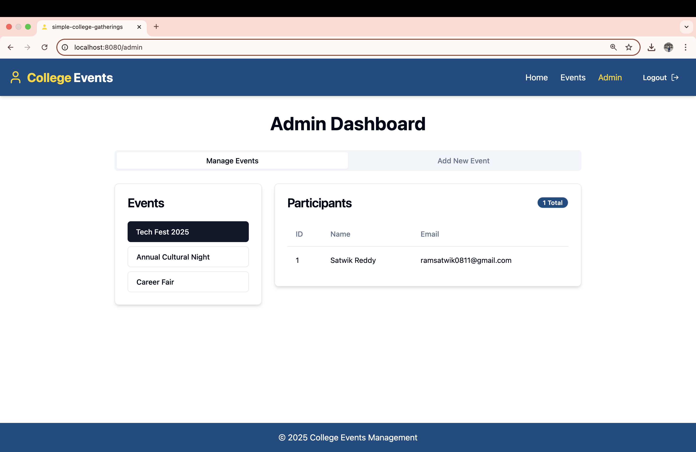

# Simple College Gatherings

A modern web app for organizing and discovering college events. Built with React, Vite, TypeScript, shadcn-ui, and Tailwind CSS.

## Features
- Student-themed branding and favicon
- Event listing and management
- User authentication
- Responsive design

## Getting Started

### Prerequisites
- Node.js (v18 or higher recommended)
- npm

### Installation
```sh
git clone https://github.com/Satwikreddy0811/simple_College_Gathering.git
cd simple_College_Gathering
npm install
```

### Running the App
```sh
npm run dev
```
Visit [http://localhost:8080](http://localhost:8080) in your browser.

## Tech Stack
- [React](https://react.dev/)
- [Vite](https://vitejs.dev/)
- [TypeScript](https://www.typescriptlang.org/)
- [shadcn/ui](https://ui.shadcn.com/)
- [Tailwind CSS](https://tailwindcss.com/)

## Screenshots
### Home Page


### Events Page


### Admin Dashboard


## Usage
- Navigate to the home page to view upcoming events.
- Use the events page to manage and create new events.
- Log in to access admin features.

## Deployment
To deploy this project, you can use platforms like Vercel, Netlify, or GitHub Pages. Follow the platform-specific instructions for deployment.

## Contributing
Pull requests are welcome! For major changes, please open an issue first to discuss what you would like to change.

## License
[MIT](LICENSE)
